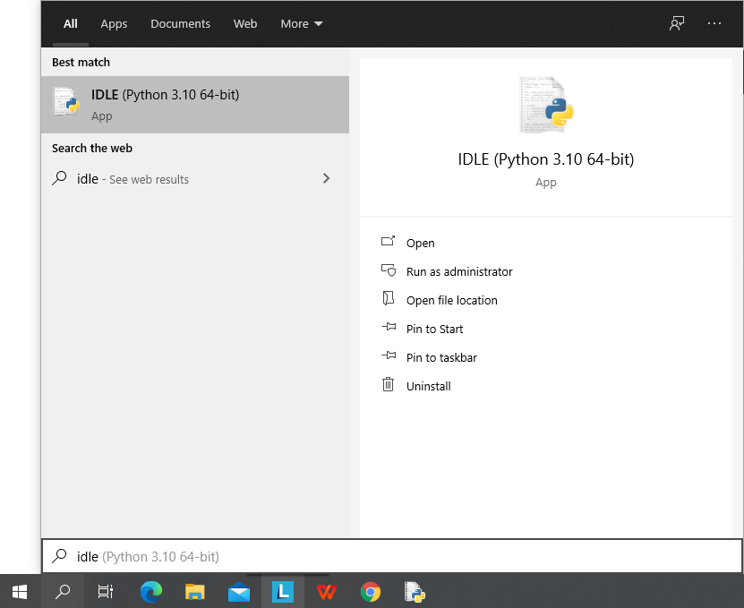
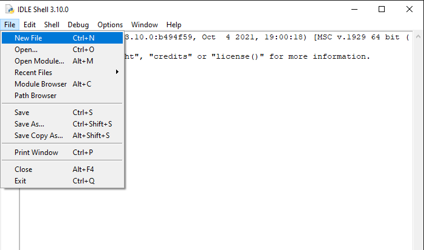
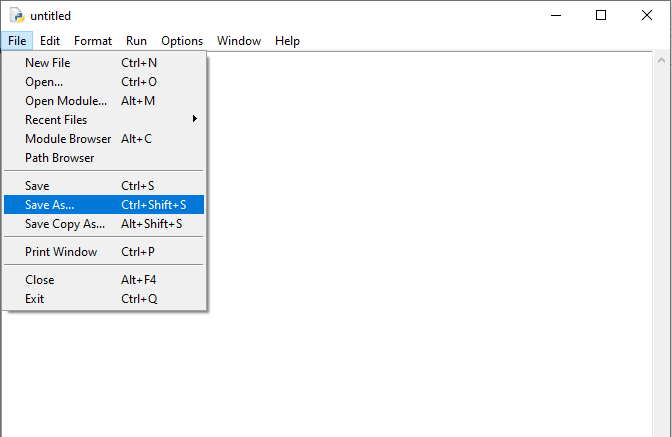
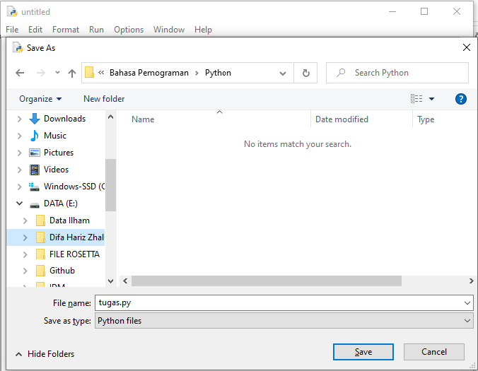
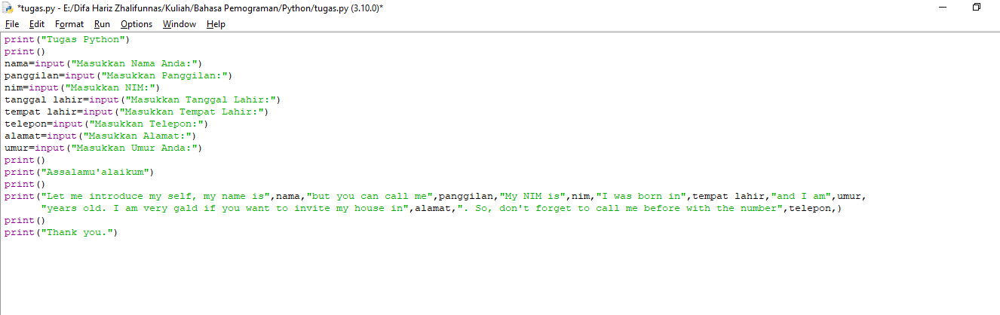
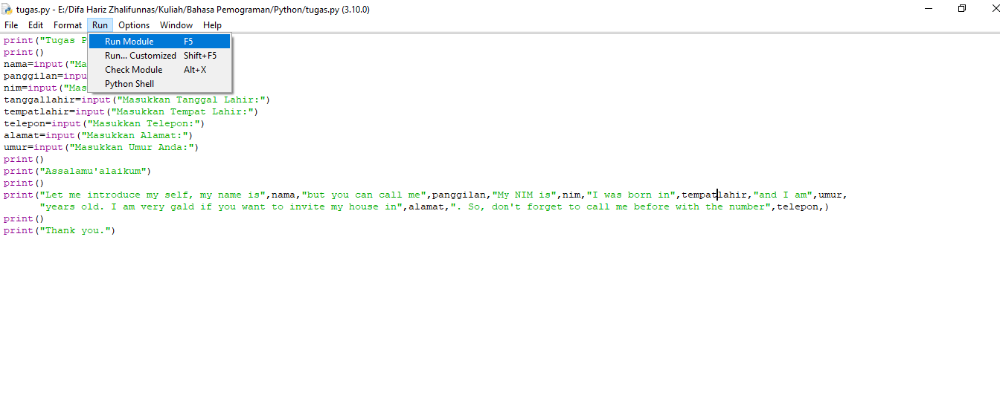
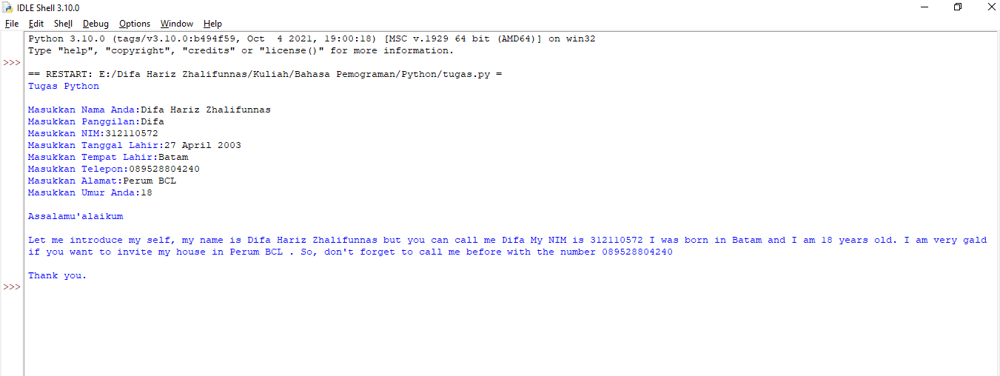

# Python
## Cara Input Menggunakan Python
- Buka IDLE Python di pencarian

- Klik (File - New File)

- Setelah itu Klik (File - Save)

- Kemudian pilih tempat untuk menyimpan file Python "JANGAN LUPA MENGGUNAKAN .py"

- Koding sesuai kalian

- Setelah selesai koding, pilih (Run - Run Module) untuk menjalankan program

## OUTPUT

- SELESAI